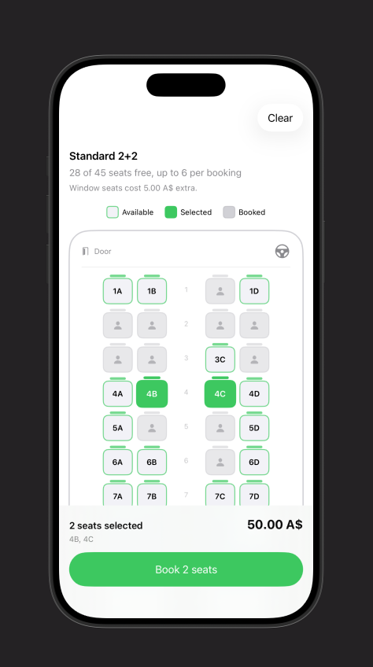

# BusBooking

A SwiftUI iOS app for choosing and booking bus seats. Passengers see a seat map of the bus, tap the seats they want, see the total price update, and book. Availability refreshes live, so seats taken by other passengers are marked as booked while you're still choosing.

<p align="center">
  
</p>

## Features

- **Seat map generated from a layout.** Rows, seats on each side of the aisle, and an optional full-width back row are all set in one place. Seats are named by row and letter (1A, 1B, 1C, 1D…), and the aisle shows the row number.
- **Three seat states.** Available seats have a green outline, selected seats are filled green, and booked seats are grey with a passenger icon and can't be tapped.
- **Live availability.** The app checks for newly booked seats every 4 seconds. If another passenger takes a seat you had selected, it's removed from your selection and you get an alert. Pull down to refresh manually.
- **Pricing.** Each layout has a base price and an optional window-seat surcharge. The total updates as you select seats and uses your device's currency (for example, A$ in Australia).
- **Selection limit.** Up to 6 seats per booking by default.
- **Booking flow.** The Book button shows a spinner while booking. If a seat was taken at the last moment, the booking is stopped, that seat is marked as booked, and your other selections are kept.
- **Clear button** to deselect everything at once.
- **Bus type switcher** for Standard 2+2, Luxury 2+1 and Minibus 1+2 layouts.
- **Haptics and accessibility.** Selection, success, warning and error haptics, plus VoiceOver labels for every seat (for example, "Seat 1A, window, Available").
- **Mock backend included**, so the app works straight away with no server.

## Requirements

- iOS 17.0 or later
- Xcode 15 or later
- Swift 5.9 or later

## Getting started

1. Clone the repository:
   ```bash
   git clone https://github.com/MdAkramHossain98/BusSeatBooking.git
   ```
2. Open `BusBooking.xcodeproj` in Xcode.
3. Choose an iPhone simulator and press **⌘R**.

## Project structure

```
BusBooking/
├── BusBookingApp.swift                 App entry point
├── Models/
│   ├── SeatStatus.swift                available / selected / booked
│   ├── Seat.swift                      Seat and GridCell
│   └── BusLayout.swift                 Layout presets and seat grid builder
├── Services/
│   ├── SeatBookingService.swift        Protocol your backend implements, and BookingError
│   └── MockSeatBookingService.swift    Fake backend for development
├── ViewModels/
│   └── SeatBookingViewModel.swift      Seat state, live updates and booking logic
├── Utilities/
│   ├── Haptics.swift                   Haptic feedback helpers
│   └── SeatStatus+Style.swift          Seat colors
└── Views/
    ├── ContentView.swift               Navigation and bus type switcher
    └── SeatBooking/
        ├── SeatBookingView.swift       The full booking screen
        ├── SeatBookingHeader.swift     Bus name, seats free and pricing note
        ├── SeatLegendView.swift        Available / Selected / Booked key
        ├── BusDeckView.swift           Bus outline, door, driver and seat grid
        ├── SeatView.swift              A single seat
        └── BookingSummaryBar.swift     Selection, total price and Book button
```

## How it works

1. `BusLayout.build()` turns a layout description into a grid of seats and aisle cells.
2. `SeatBookingViewModel` holds every seat's status. It loads booked seats from the service when the screen appears, then polls for changes every 4 seconds.
3. The views only display the view model's state and call its methods (`toggle`, `clearSelection`, `confirmBooking`), so all logic lives in one file.
4. Anything that talks to a server goes through the `SeatBookingService` protocol. The app uses `MockSeatBookingService` until you provide a real one.

## Customizing

### Change the bus layout or prices

Edit or add presets in `Models/BusLayout.swift`:

```swift
static let coach = BusLayout(
    name: "Coach 2+2",
    rows: 13,
    leftColumns: 2,
    rightColumns: 2,
    fullBackRow: true,      // last row spans the aisle
    basePrice: 32,
    windowSurcharge: 4,
    currencyCode: "AUD"     // defaults to the device's currency
)

static let presets: [BusLayout] = [.standard, .luxury, .minibus, .coach]
```

Adding a layout to `presets` makes it appear in the bus switcher automatically.

### Change the seat colors

Edit `Utilities/SeatStatus+Style.swift`. The `fill`, `stroke` and `foreground` colors for each state are used by the seats and the legend, so one change restyles the whole screen.

### Change the seat limit or seat size

```swift
SeatBookingView(layout: .standard, maxSeats: 4, seatSize: 40)
```

### Change how often availability refreshes

In `SeatBookingView.swift`, pass a different interval to `startLiveUpdates`:

```swift
viewModel.startLiveUpdates(every: .seconds(10))
```

## Connecting a real backend

Create a type that conforms to `SeatBookingService`:

```swift
import Foundation

struct APISeatBookingService: SeatBookingService {
    let tripID: String

    func fetchUnavailableSeats() async throws -> Set<String> {
        let url = URL(string: "https://api.example.com/trips/\(tripID)/booked-seats")!
        let (data, _) = try await URLSession.shared.data(from: url)
        return try JSONDecoder().decode(Set<String>.self, from: data)
    }

    func book(seatIDs: [String]) async throws {
        var request = URLRequest(url: URL(string: "https://api.example.com/trips/\(tripID)/bookings")!)
        request.httpMethod = "POST"
        request.setValue("application/json", forHTTPHeaderField: "Content-Type")
        request.httpBody = try JSONEncoder().encode(["seats": seatIDs])

        let (data, response) = try await URLSession.shared.data(for: request)
        if (response as? HTTPURLResponse)?.statusCode == 409 {
            // The server says some seats were already taken
            let taken = try JSONDecoder().decode([String].self, from: data)
            throw BookingError.seatsUnavailable(taken)
        }
    }
}
```

Then pass it to the view:

```swift
SeatBookingView(layout: .standard, service: APISeatBookingService(tripID: "SYD-MEL-0915"))
```

Your API should use the same seat IDs as the app (`1A`, `1B`, …). No other code needs to change.

## Previews

`ContentView.swift`, `SeatBookingView.swift`, `SeatLegendView.swift` and `SeatView.swift` include SwiftUI previews. Open one of them and press **⌥⌘↩** to show the canvas, then click the Live button to interact with it. `SeatView.swift` shows all three seat states side by side, which is useful when adjusting colors.

## Troubleshooting

**"Type 'SeatBookingViewModel' does not conform to protocol 'ObservableObject'"** or **"missing import of defining module 'Combine'"**
Make sure `SeatBookingViewModel.swift` starts with both imports:
```swift
import SwiftUI
import Combine
```

**"'topBarTrailing' is only available in iOS 17.0 or newer"**
Select the project in Xcode, open the **General** tab and set **Minimum Deployments** to iOS 17.0 or later.

**"Invalid redeclaration of …"**
The same type exists in two files. This usually happens when an older single-file version is still in `ContentView.swift`. Remove the duplicate.

**Preview shows an error**
Build the app once with **⌘B**, then refresh the canvas with **⌥⌘P**.

## Contributing

Issues and pull requests are welcome. Please keep logic in the view model and services, and keep views focused on display.

## License

This project is available under the MIT License. See [LICENSE](LICENSE) for details.
